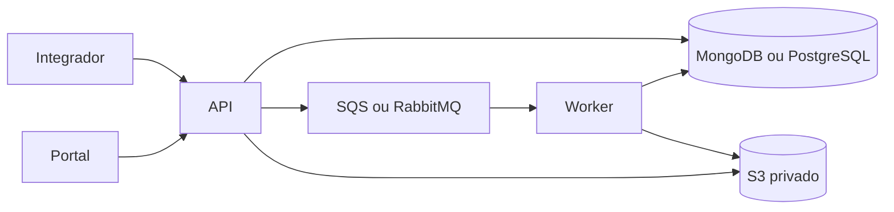

# CentralDeDownloads

[](https://github.com/gersonlucasangeloviana/CentralDeDownloads/actions/workflows/ci.yml)

API .NET 10 para gerar e disponibilizar arquivos XLSX, CSV e JSON de forma assíncrona. A API recebe até 1.000 registros por lote (limitados a 1 MiB), um worker envia o resultado em fluxo ao S3 e o portal administrativo permite acompanhar o processamento e baixar o arquivo. Solicitações XLSX com mais de um milhão de registros são convertidas para CSV ao concluir a ingestão.

## Recursos

- Geração e upload multipart em fluxo, sem manter o arquivo inteiro em memória ou em disco temporário.
- MongoDB ou PostgreSQL para armazenar trabalhos e lotes; SQS ou RabbitMQ para distribuir a geração.
- Armazenamento privado no S3, links temporários de download e notificações opcionais por webhook ou e-mail.
- Portal administrativo separado da API e documentação interativa em `/swagger`.

## Arquitetura



## Projetos

| Projeto | Responsabilidade |
| --- | --- |
| `src/CentralDeDownloads.Api` | Minimal API, autenticação por chave, ingestão, conclusão, status, links e manutenção |
| `src/CentralDeDownloads.Worker` | Consome SQS ou RabbitMQ, gera arquivos em fluxo e envia ao S3 |
| `src/CentralDeDownloads.Portal` | Interface administrativa separada, com cookie e proxy para a API |
| `src/CentralDeDownloads.Core` | Modelos, MongoDB/PostgreSQL, SQS/RabbitMQ, S3, validação e geração dos três formatos |

## Início rápido

Requisitos: .NET 10, Docker e Python 3. Para executar com MongoDB, SQS e S3 locais:

1. Inicie as dependências com `docker compose -f compose.dev.yaml up -d`.
2. Crie `.env.local` seguindo o [guia de desenvolvimento local](docs/desenvolvimento-local.md).
3. Em três terminais, carregue `.env.local` com `set -a; source .env.local; set +a` e execute, respectivamente:

   ```bash
   dotnet run --project src/CentralDeDownloads.Api --launch-profile http
   dotnet run --project src/CentralDeDownloads.Worker
   dotnet run --project src/CentralDeDownloads.Portal --launch-profile http
   ```

A documentação da API fica em [http://localhost:5151/swagger/](http://localhost:5151/swagger/) e o portal em [http://localhost:5192](http://localhost:5192). O [guia local](docs/desenvolvimento-local.md) também mostra como rodar os testes de ponta a ponta e trocar banco ou fila.

## Contrato da API

As rotas de operação exigem o cabeçalho `X-Api-Key`. As exceções são `/health`, `/health/ready` e `/v1/downloads/{token}`. A interface interativa fica em **`/swagger`** e o documento OpenAPI em **`/openapi/v1.json`**; ambos são públicos para que a documentação possa ser consultada sem uma chave. O [guia de uso da API](docs/api.md) detalha as possibilidades de preenchimento, os três formatos de saída e o fluxo completo; a [coleção Postman](postman/README.md) permite executar exemplos. Para usar **Try it out** nas rotas protegidas, clique em **Authorize** no Swagger e cole somente o valor da chave configurada em `Security:ApiKey`. A documentação inclui exemplos preenchidos, os campos obrigatórios, limites e possíveis respostas. Configure `Swagger__Enabled=false` para desativar a interface e o documento.

1. `POST /v1/arquivos` cria o trabalho:

   ```json
   {
     "nome": "Vendas de setembro",
     "formato": "xlsx",
     "periodo": { "inicio": "2026-09-01", "fim": "2026-09-30" },
     "webhook": "https://exemplo.com/arquivo",
     "email": "pessoa@exemplo.com"
   }
   ```

   Apenas `nome` e `formato` são obrigatórios. `formato` aceita `xlsx`, `csv` e `json`. Se e-mail e webhook forem informados, ambos recebem a notificação.

2. `POST /v1/arquivos/{id}/lotes` recebe:

   ```json
   {
     "id": "id-retornado-na-criacao",
     "idLote": "opcional",
     "dados": [
       { "Pedido": "123", "Valor": "149,90" },
       { "Pedido": "124", "Valor": "250,00" }
     ]
   }
   ```

   São aceitos de 1 a 1.000 registros e até 1 MiB por requisição. Cada registro deve ser um objeto plano, sem objetos, arrays ou `null` nos campos. Valores sem conteúdo devem ser strings vazias. `idLote` é registrado, mas **não deduplica** na V1. A resposta informa a sequência de admissão atribuída pelo servidor.

3. `POST /v1/arquivos/{id}/concluir` aceita corpo vazio ou `{ "totalLotes": 10, "totalItens": 1000 }`. Totais divergentes retornam `422`, colocam o trabalho em `falhou` e descartam os lotes. Aguarde a resposta de todos os envios paralelos antes de concluir.
4. `GET /v1/arquivos/{id}` consulta estado, contagens, erro e link temporário quando pronto.
5. `GET /v1/arquivos?page=1&size=30&status=pronto` lista trabalhos.
6. `GET /v1/arquivos/{id}/download` redireciona para o S3 após autenticação.

O resultado fica disponível por 24 horas após `prontoEm`. Links enviados por webhook/e-mail duram até 3 horas e, ao serem abertos, geram um redirecionamento para uma URL S3 curta. O arquivo não passa pela API durante o download. O job diário remove objetos S3 vencidos; a exclusão física pode ocorrer depois das 24 horas. A API só inicia após preparar as estruturas do banco. `/health` verifica o processo; `/health/ready` verifica também a conexão com o banco, com limite de 3 segundos. Respostas da API/portal que contêm dados do trabalho usam `Cache-Control: no-store`.

## Configuração

Copie os nomes de [.env.example](.env.example) para o gerenciador de segredos/variáveis de cada serviço. Não grave chaves reais no repositório. Configure **os mesmos** provedores na API e no worker: `Storage__Provider` = `MongoDB` (padrão) ou `PostgreSQL`; `Queue__Provider` = `SQS` (padrão) ou `RabbitMQ`. Banco e fila podem ser escolhidos independentemente. Trocar o banco não migra dados já gravados. Trocar a fila com trabalhos pendentes exige esvaziar ou reencaminhar a fila antiga.

Para configuração local, preencha `.env.local` (ignorado pelo Git e pelo Docker). O .NET não lê esse arquivo automaticamente: em cada terminal, execute `set -a; source .env.local; set +a` antes de `dotnet run`. Não use `.env.local` como arquivo de segredos do ECS; configure os valores no gerenciador de segredos do ambiente.

- **API:** provedor e conexão do banco, provedor e conexão da fila; também `Aws__Region`, `Aws__Bucket`, `Security__ApiKey`, `Security__DownloadSigningKey`, `PublicBaseUrl`; `Resend__ApiKey` e `Resend__From` quando usar e-mail.
- **Worker:** mesmos provedores e conexões da API, além da configuração S3; sem chaves de API/Resend.
- **Portal:** `Portal__Password`, `Api__BaseUrl` (endereço interno da API) e `Api__Key` (igual a `Security__ApiKey`).
- **SQS:** `Aws__QueueUrl` é obrigatório apenas quando `Queue__Provider=SQS`.
- **RabbitMQ:** `RabbitMq__Uri` (`amqp://` ou `amqps://`) e `RabbitMq__QueueName` são obrigatórios apenas quando `Queue__Provider=RabbitMQ`. A fila é declarada como durável; a publicação espera confirmação do broker e o worker confirma cada mensagem após processá-la.
- **Desenvolvimento local com emulador AWS:** `Aws__ServiceUrl` aponta para o endpoint de S3 e, quando selecionado, SQS. As credenciais AWS padrão do SDK ainda são necessárias para S3, podendo ser valores fictícios no emulador.

O PostgreSQL cria as tabelas e índices necessários ao iniciar API ou worker. A conta do banco precisa de permissão para esse preparo inicial. Os lotes ficam em `export_batches` como `jsonb`; os metadados ficam em `export_jobs`. As transições e a admissão de lotes usam transações e bloqueio por arquivo para serializar chamadas paralelas. Em ECS, a API precisa ler/assinar S3 e excluir objetos vencidos; o worker precisa gravar/excluir objetos S3. Com SQS, conceda também à API permissão de publicar e ao worker de consumir/apagar mensagens. Com RabbitMQ, configure acesso de rede e credenciais ao broker para ambos. O bucket deve ser privado. A URL do webhook deve ser HTTPS pública na porta 443. O domínio remetente do Resend precisa estar configurado na conta.

Em produção, `PublicBaseUrl` deve ser HTTPS. Se uma solicitação informar e-mail e o Resend não estiver configurado, a API rejeita a criação com `503`. URLs de webhook são verificadas novamente na conexão para impedir troca de DNS para um endereço privado; redirecionamentos HTTP são desativados. O portal exige token antifalsificação no login/logout e limita tentativas de login. O worker registra a chave S3 ao assumir o trabalho; se ele cair após um upload, a rotina horária remove o objeto de trabalhos encerrados em falha.

## Build e testes

```bash
dotnet restore CentralDeDownloads.slnx
dotnet build CentralDeDownloads.slnx -c Release
dotnet test CentralDeDownloads.slnx -c Release
```

Imagens de container:

```bash
docker build -f Dockerfile.api -t central-downloads-api .
docker build -f Dockerfile.worker -t central-downloads-worker .
docker build -f Dockerfile.portal -t central-downloads-portal .
```

O Compose local inicia MongoDB, PostgreSQL, RabbitMQ e LocalStack 4.12 para S3/SQS. Os nomes de banco, bucket e fila usados nesses exemplos são exclusivos do ambiente local; o [guia local](docs/desenvolvimento-local.md) contém os valores e comandos completos.

Um benchmark anterior do escritor XLSX, sem leitura do banco nem upload S3, gerou 1.048.577 registros em duas abas e um arquivo de 228 MB em cerca de 8 segundos num Mac ARM local. Esse teste precede a conversão atual de XLSX grande para CSV. Para medições de ponta a ponta, veja o [roteiro de carga](docs/teste-carga-worker.md) e o [diário comparativo](docs/diario-comparativo-ingestao.md).

Há uma imagem/tarefa ECS para cada serviço; a configuração inicial é uma task da API, uma do worker e uma do portal. O worker processa um arquivo por vez e a fila escolhida absorve pedidos simultâneos. O prazo de processamento é de 30 minutos desde a conclusão; o verificador horário marca trabalhos abandonados como falha. A API mantém o histórico por 30 dias e limpa solicitações abertas sem atividade por mais de 30 minutos.

## Limitações conhecidas da V1

- A primeira linha do primeiro lote admitido define colunas e ordem. Lotes posteriores **não são comparados** contra esse cabeçalho; campos ausentes viram células vazias no XLSX/CSV e campos extras são ignorados nesses formatos. O JSON conserva o registro recebido. Validar consistência entre lotes é débito técnico da V2.
- Não há retry funcional nem substituição de lotes. Uma repetição de `POST /lotes` pode duplicar registros. O worker impede duas gerações simultâneas do mesmo ID por transição condicional de estado, pois a fila pode reenviar mensagens.
- Notificações são tentadas uma vez e têm resultado registrado; uma falha de e-mail ou webhook não altera o estado `pronto`.
- Os lotes são armazenados no banco escolhido. Para arquivos grandes, monitore capacidade e desempenho do MongoDB ou PostgreSQL. Um milhão de registros exige ao menos mil chamadas com lotes de 1.000 itens, desde que cada corpo caiba em 1 MiB.
- Docker não é necessário para os testes unitários. Os testes de ponta a ponta dependem de banco, fila e S3 configurados.

## Preparação para publicação

- Configurar segredos no gerenciador da plataforma, HTTPS na entrada, rede privada para banco e broker e permissões mínimas para S3/SQS. O portal deve ser acessível apenas pelo administrador.
- Criar no bucket S3 uma regra de ciclo de vida para **abortar uploads multipart incompletos** após um dia. A limpeza da aplicação apaga objetos concluídos, mas uma queda abrupta pode deixar partes de um upload multipart no S3. [Documentação da AWS](https://docs.aws.amazon.com/AmazonS3/latest/userguide/intro-lifecycle-rules.html).
- Configurar DLQ no SQS ou política equivalente no RabbitMQ e alertas para idade da fila, trabalhos `falhou`, ausência do worker, erros de notificação, capacidade do banco e espaço temporário do container.
- Manter uma task do portal na V1. Para usar várias réplicas, persistir o chaveiro ASP.NET Data Protection para que compartilhem os cookies de autenticação.
- Medir o tempo de ponta a ponta e uso de disco/RAM com cargas reais na task ECS escolhida antes de atender arquivos de 200 MB.

## Documentação

- [Guia da API](docs/api.md): contrato, exemplos de requisições e respostas.
- [Desenvolvimento local](docs/desenvolvimento-local.md): configuração, execução e testes de ponta a ponta.
- [Arquitetura da V1](docs/arquitetura-inicial.md): premissas, decisões e limites.
- [Infraestrutura AWS](infra/aws/README.md): Terraform, imagens e operação do ambiente de demonstração.
- [Revisão técnica](docs/revisao-publicacao.md): correções verificadas e pontos para operação.
- [Coleção Postman](postman/README.md): fluxos CSV e XLSX executáveis. A pasta `postman/` fica fora das imagens Docker.
- [Publicação AWS](docs/arquitetura-publicacao-aws.md): diagrama da infraestrutura e fluxo de arquivos.
- [Resultados de carga](docs/resultado-teste-carga-aws-2026-10-03.md): medições da implantação de demonstração.
- [Diário comparativo da V2](docs/diario-comparativo-ingestao.md): medições locais e na AWS, incluindo 10 milhões de linhas e quatro arquivos simultâneos.
- [Benchmarks e logs](benchmarks/README.md): índice dos resultados brutos e dos cenários executados.
- [Estimativa de custo mensal da V2](docs/estimativa-custo-mensal-v2.md): base contínua e custos variáveis do serviço publicado.

## Licença

Distribuído sob a [licença MIT](LICENSE).
