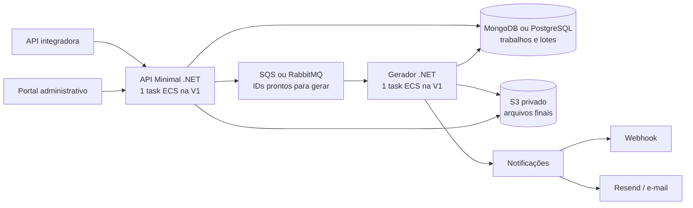

# Central de geração e download de arquivos — especificação inicial da V1

**Estado:** V1 implementada e validada localmente; implantação na AWS pendente  
**Atualizado em:** 2026-10-02

## 1. Objetivo

Uma API recebe dados JSON em lotes, gera arquivos XLSX, CSV ou JSON após uma chamada de conclusão, guarda os resultados no S3 e oferece consulta de status, download e notificações opcionais por webhook e e-mail. Um portal administrativo separado lista os arquivos e permite baixá-los. O recebimento de lotes e a geração são serviços .NET separados para permitir escala futura independente.

## 2. Requisitos confirmados

- ASP.NET Core Minimal API em .NET, frontend e backend separados, publicados em ECS. Na primeira implantação de testes: **uma task da API e uma task do gerador**, sem configurar escala automática. O portal pode ter implantação própria.
- Cerca de **400 arquivos por dia**, incluindo aproximadamente 100 nas primeiras horas da manhã. Algumas gerações podem ocorrer em paralelo. Arquivos podem chegar a **200 MB** e planilhas a **um milhão de linhas ou mais**.
- A criação retorna um ID. Recebe `formato`, `nome` obrigatório, `periodo` opcional, `webhook` opcional e `email` opcional. O Resend é o provedor desejado para e-mail.
- O corpo de cada lote contém ID do arquivo, `idLote` opcional e `dados` com **1 a 100 registros**. Acima de 100: erro sem gravação do lote. Lotes podem chegar em paralelo; não se promete a ordem original do cliente nessa situação.
- Cada registro é um objeto JSON plano para uma linha da tabela. Arrays ou objetos aninhados são rejeitados na própria requisição, inclusive no primeiro lote. O cliente deve enviar a mesma estrutura em todos os registros, com campos presentes e valor vazio quando aplicável.
- As colunas são definidas pela ordem dos campos do primeiro registro do primeiro lote aceito. A V1 **não compara o conjunto de campos entre lotes**; essa verificação é débito técnico explícito.
- Uma chamada final pode vir sem totais ou com totais esperados de registros e/ou lotes. Divergência fecha o trabalho em erro, apaga os dados temporários e exige nova solicitação e novo envio.
- A V1 não faz retry funcional da geração nem exige chave idempotente de lote. `idLote` pode ser informado, mas é opcional. Falhas de processamento encerram o trabalho em erro.
- A geração tem prazo de **até 30 minutos**. Um verificador roda a cada hora para encontrar trabalhos travados. Solicitações ainda abertas sem novo lote por 30 minutos são candidatas à limpeza.
- XLSX tem apenas texto e cabeçalho em negrito; ao atingir o limite de linhas por aba, continua em outra aba. CSV usa `;`. JSON final é um único array convencional.
- Portal inicialmente acessível apenas ao administrador para consulta e download. Clientes finais recebem o link pela API integradora existente.
- Arquivo final disponível por **24 horas a partir de `prontoEm`**; rotina diária remove objetos vencidos do S3. Histórico do trabalho fica no banco escolhido por 30 dias. Lotes temporários são apagados após sucesso/erro e por rotina de limpeza para trabalhos abandonados.
- Banco configurável: **MongoDB Atlas ou PostgreSQL**; fila configurável: **SQS ou RabbitMQ**. API e worker devem selecionar os mesmos provedores e conexões. O bucket S3 armazena arquivos finais.

## 3. Arquitetura proposta



**Responsabilidades:** a API cria trabalhos, valida e persiste lotes, conclui a ingestão e consulta status. O gerador consome IDs da fila, lê os lotes em fluxo, gera o formato pedido, grava o objeto S3 e atualiza o estado. Notificações são disparadas depois de o estado final estar persistido; sua falha não converte um arquivo pronto em falha de geração. A fila contém apenas o ID, nunca a carga dos lotes. O SQS pode entregar mensagens duplicadas; RabbitMQ também pode reenviá-las quando uma confirmação de consumo não chega. O worker protege a transição de estado contra execução duplicada mesmo que a V1 não ofereça retry funcional. A publicação RabbitMQ usa fila/mensagem duráveis e confirmação do broker. [SQS padrão](https://docs.aws.amazon.com/AWSSimpleQueueService/latest/SQSDeveloperGuide/standard-queues.html), [confirmações RabbitMQ](https://www.rabbitmq.com/tutorials/tutorial-seven-dotnet).

**Armazenamento temporário da V1:** os lotes ficam no banco selecionado por `Storage:Provider`. MongoDB usa as coleções `arquivos` e `lotes`; PostgreSQL usa as tabelas `export_jobs` e `export_batches` com dados JSONB. A troca do provedor não migra dados anteriores. Se for usado o plano gratuito do Atlas, dados mais índices estão sujeitos a uma cota de armazenamento; o JSON bruto pode ocupar mais espaço que o XLSX final. Um milhão de registros em lotes de 100 implica pelo menos 10 mil chamadas HTTP e registros de lote. Medir capacidade e latência no provedor escolhido antes dessa carga. S3 temporário permanece como alternativa de evolução. [Limites do Atlas](https://www.mongodb.com/docs/atlas/manage-clusters/), [quota rígida](https://www.mongodb.com/docs/atlas/reference/faq/storage/).

**Deploy inicial:** uma task sempre ativa para API e outra para gerador. Isso limita o gerador a uma geração de cada vez até aferir CPU, RAM e disco; várias solicitações simultâneas ficam na fila. O serviço de gerador já nasce isolado para permitir aumentar o número de tasks mais tarde. Com SQS, o backlog pode alimentar a escala do ECS; com RabbitMQ, será necessária métrica de backlog do broker. [Escala ECS por SQS](https://docs.aws.amazon.com/AmazonECS/latest/developerguide/service-autoscaling-queue.html).

## 4. Contrato HTTP preliminar

### Criar arquivo

`POST /v1/arquivos`

```json
{
  "nome": "Vendas setembro 2026",
  "formato": "xlsx",
  "periodo": { "inicio": "2026-09-01", "fim": "2026-09-30" },
  "webhook": "https://cliente.exemplo.com/arquivo-pronto",
  "email": "usuario@exemplo.com"
}
```

`periodo`, `webhook` e `email` podem ser omitidos. Retorno `201` com `id`, `status: "recebendo"` e links de operação. Se webhook e e-mail vierem juntos, **ambas** as notificações são enviadas. Sem os dois, o cliente consulta `GET`.

### Enviar lote

`POST /v1/arquivos/{id}/lotes`

```json
{
  "id": "id-do-arquivo",
  "idLote": "opcional",
  "dados": [
    { "Pedido": "123", "Cliente": "Ana", "Valor": 149.90 },
    { "Pedido": "124", "Cliente": "Bruno", "Valor": 250.00 }
  ]
}
```

A API rejeita o lote inteiro se `id` não corresponder à rota, `dados` não for array com 1 a 100 objetos, algum valor contiver objeto/array, o corpo exceder o limite técnico de bytes ou o trabalho não estiver em `recebendo`. `idLote` fica registrado para rastreamento, **sem deduplicação garantida na V1**. O servidor pode devolver uma sequência incremental de admissão; ela não reconstitui a ordem do cliente quando as chamadas são paralelas. Um retry HTTP do mesmo lote pode duplicar linhas na V1.

### Concluir, consultar e baixar

- `POST /v1/arquivos/{id}/concluir` aceita corpo ausente ou `{ "totalLotes": 10, "totalItens": 1000 }`. Sem totais, o cliente deve aguardar o sucesso de **todas** as requisições de lote antes de concluir. A API fecha a entrada, aguarda lotes já admitidos e compara os totais informados. Em divergência: HTTP `422`, `falhou`, motivo persistido, lote temporário apagado e notificação de erro; o status definitivo fica consultável.
- `GET /v1/arquivos/{id}` retorna nome, período, formato, status, contagens, horários, erro e `expiraEm` quando pronto. O link de download pode ser emitido sob demanda para evitar guardar uma URL que já expirou.
- `GET /v1/arquivos` lista para o portal, com paginação e filtros por nome, período, formato, status e data.
- `GET /v1/arquivos/{id}/download` ou endpoint equivalente gera um redirecionamento para o S3 depois de validar o direito de acesso e o prazo. O modelo de link para notificações está descrito na seção 7.

**Estados:** `recebendo` → `fechando` → `na_fila` → `processando` → `pronto`; `falhou` e `expirou` são estados finais. Somente `pronto` oferece download. A conclusão precisa impedir novos lotes e aguardar gravações já admitidas; caso contrário, há risco de gerar arquivo incompleto. O worker deve marcar `processando` de forma condicional para impedir que duas entregas da fila gerem o mesmo trabalho.

## 5. Modelo de dados e limpeza

**Trabalhos (`arquivos` ou `export_jobs`):** `id`, nome, período opcional, formato, webhook opcional, e-mail opcional, status, colunas, contagens, `criadoEm`, `ultimaAtividadeEm`, `fechadoEm`, `inicioProcessamentoEm`, `prontoEm`, `expiraEm`, `erro`, chave/tamanho S3 e estado de notificação. O histórico de trabalhos finalizados é removido após 30 dias contados de `criadoEm`.

**Lotes (`lotes` ou `export_batches`):** `idArquivo`, sequência de admissão, `idLote` opcional, `recebidoEm` UTC, quantidade e JSON dos dados. O `recebidoEm` solicitado fica em cada lote; a regra de abandono usa `ultimaAtividadeEm` do arquivo. A implementação limita cada requisição a **1 MiB** e 100 itens. No PostgreSQL, cada admissão é transacional e bloqueia a linha do trabalho para definir sequência, cabeçalho e contagens com segurança. [Limite BSON do MongoDB](https://www.mongodb.com/docs/manual/core/document/).

**Limpeza:**

1. Sucesso: disponibilizar S3 final, marcar `pronto`, notificar e apagar lotes/objetos temporários.
2. Erro de geração ou divergência de totais: marcar `falhou`, registrar motivo, notificar e apagar temporários. Não reprocessar na V1.
3. Aberto e inativo por mais de 30 minutos desde o último lote: verificador horário marca erro/expiração e apaga temporários. Como roda a cada hora, o apagamento pode ocorrer quase **90 minutos** após a última atividade.
4. Processamento acima de 30 minutos: o worker deve impor o prazo e interromper a geração; o verificador horário recupera trabalhos abandonados por queda da task. Se depender apenas do verificador horário, o prazo real pode superar 30 minutos.
5. Arquivo pronto: negar novos downloads após `prontoEm + 24 horas`. Um job diário apaga do S3 arquivos com mais de 24 horas. A exclusão física pode ocorrer até quase 48 horas após `prontoEm`; o histórico permanece por 30 dias. Lifecycle do S3 pode ser salvaguarda, mas também é assíncrono. [Expiração no S3](https://docs.aws.amazon.com/us_en/AmazonS3/latest/userguide/lifecycle-expire-general-considerations.html).

O processo de limpeza nunca apaga lotes de um trabalho `na_fila` ou `processando` somente por idade do lote. Precisa verificar estado e propriedade do trabalho antes de apagar. Uma falha no meio de um upload ao S3 também exige abortar/limpar o resultado parcial.

## 6. Regras dos formatos

- **Comum:** cada item é um objeto plano; objetos, arrays internos e `null` são rejeitados na V1. Valores sem conteúdo devem vir como strings vazias. O primeiro registro do primeiro lote **admitido** estabelece os nomes e a ordem das colunas. Todos os lotes são validados quanto à estrutura plana, mas a V1 confia que as mesmas colunas estarão presentes em todos eles.
- **XLSX:** todas as células de dados são texto; o cabeçalho fica em negrito. A cada aba cabem 1.048.576 linhas, incluindo o cabeçalho; ao completar 1.048.575 registros, abrir nova aba e repetir o cabeçalho. Também há limites de 16.384 colunas e 32.767 caracteres por célula. É obrigatória uma biblioteca/modo de escrita incremental; tamanho e tempo de geração serão medidos com 200 MB e mais de um milhão de linhas. [Limites do Excel](https://support.microsoft.com/pt-br/excel/excel-specifications-and-limits).
- **CSV:** uma linha de cabeçalho, separador `;`, escape correto de aspas/quebras de linha, escrita incremental e codificação UTF-8 com BOM. Proteger células que começam com caracteres interpretáveis como fórmula ao abrir no Excel.
- **JSON:** um único array JSON (`[ {...}, {...} ]`), escrito em fluxo para não carregar tudo em memória.

### Débito técnico explícito — consistência das colunas

A V1 não compara campos nem tipos entre lotes. Campos ausentes viram células vazias em XLSX/CSV e extras são ignorados nesses formatos; o JSON conserva cada registro como recebido. Na V2, validar todo registro contra o cabeçalho congelado e responder erro já no envio do lote.

## 7. Notificações e links de download

Quando o trabalho chega a `pronto` ou `falhou`, consultar os destinos informados na criação. Se houver webhook, enviar um objeto com os metadados completos, status, contagens, horários e link quando pronto; em erro, enviar motivo e omitir link. Se houver e-mail, enviar via [SDK/API .NET do Resend](https://resend.com/dotnet) com nome, período, estado e link quando pronto. O e-mail conterá **link**, não anexo de 200 MB. Registrar resultado do envio separadamente do estado da geração.

**Webhook V1:** chamada de saída sem autenticação ou assinatura no destino, conforme decidido. Mesmo assim, validar URL pública HTTPS e bloquear destinos internos antes de enviar, para evitar que uma URL fornecida pelo cliente faça a API chamar serviços privados. A implementação inicial tenta webhook e Resend uma vez e registra falhas; elas não alteram o estado `pronto` do arquivo. Retry de notificação pode ser acrescentado depois.

**Validade separada:** o **arquivo** permanece disponível por 24 horas após ficar pronto, mas o **link enviado na notificação** precisa durar apenas algumas horas. A consulta de status e o portal podem emitir outro link enquanto o arquivo ainda estiver disponível.

**Implementação da V1:** o webhook/e-mail recebe um link assinado pelo próprio serviço, com duração configurável inicialmente de **3 horas**, limitada também por `prontoEm + 24 horas`. Ao clicar, a API confere assinatura, estado e prazo, cria uma URL S3 curta e responde `302`; o arquivo de até 200 MB flui diretamente do S3 para o usuário. Esse link funciona como credencial de posse e não deve aparecer em logs. Uma URL S3 direta emitida por task ECS pode vencer antes do tempo pedido quando as credenciais temporárias da task expiram; o redirecionamento evita prometer algumas horas com essa URL efêmera e dispensa CloudFront na V1. [Fonte: validade de URLs S3](https://docs.aws.amazon.com/AmazonS3/latest/userguide/using-presigned-url.html).

## 8. Operação inicial e evolução

- Criar imagens pequenas .NET 10 LTS, executar sem root e separar configuração/segredos do código. [Contêineres .NET](https://learn.microsoft.com/en-us/dotnet/core/docker/).
- Limitar memória, CPU, tamanho HTTP e disco temporário da task. Uma geração por worker na V1; solicitações adicionais ficam na fila.
- Registrar métricas de lotes/bytes, arquivos na fila, idade da fila, tempo e pico de memória por formato/tamanho, falhas de geração e de notificação, capacidade do banco escolhido, objetos temporários e exclusões.
- O prazo de 30 minutos exige medição real do XLSX grande em task com recursos definidos. O caso de um milhão de linhas em lotes de 100 implica ao menos 10 mil chamadas HTTP de lote; esse caminho precisa ser testado de ponta a ponta.
- Sem retry funcional, manter registro de erro operacional e garantir que trabalhos travados sejam finalizados como `falhou` pelo verificador. Na implantação, configurar DLQ no SQS ou política equivalente no RabbitMQ. A fila pode reenviar mensagens por sua própria semântica; isso não autoriza uma segunda geração funcional.
- Depois dos testes, configurar auto scaling somente para o serviço gerador, baseado em backlog por task, tempo real de geração e prazo aceito; manter a API separada.

## 9. Decisões da V1 e evolução

- O link de notificação dura até 3 horas e pode ser reemitido pela consulta de status enquanto o arquivo estiver disponível.
- A geração tem prazo de 30 minutos contado da chamada `concluir`, incluindo a espera na fila. O worker aplica esse prazo e o verificador horário encerra trabalhos abandonados.
- A API usa `X-Api-Key`; o portal administrativo usa senha e cookie. `periodo` é um par de datas usado como metadado e filtro. O histórico de estados finais é retido por 30 dias desde a criação.
- Além de 100 registros, cada lote tem limite de 1 MiB. CSV é UTF-8 com BOM. O gerador XLSX escreve em fluxo e abre outra aba quando atinge o limite do Excel.
- Na V2, considerar validação de colunas entre lotes, idempotência, retry de geração/notificações e auto scaling do worker.

## 10. Próximos passos para implantação

1. Criar MongoDB Atlas ou PostgreSQL, bucket S3 privado, SQS ou RabbitMQ, segredos e serviços ECS para as três imagens; configurar rede, IAM, HTTPS e domínio público da API.
2. Medir ingestão, armazenamento no banco escolhido e tempo de ponta a ponta com cargas reais, inclusive um milhão de registros, no tamanho de task escolhido.
3. Definir infraestrutura como código e alarmes para fila, prazo de geração, falhas e uso do banco escolhido antes de escalar o worker.
