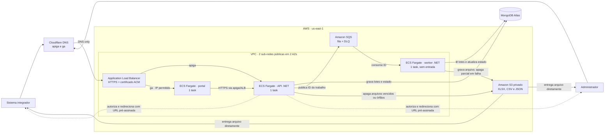

# Arquitetura da publicação na AWS

Este desenho mostra a configuração de publicação definida em `infra/aws` e usada no teste de carga da API publicado em 2026-10-03. O MongoDB Atlas e o DNS da Cloudflare são serviços externos à conta AWS.

## Diagrama da infraestrutura

**Acesso ao S3:** API e worker usam roles IAM distintas. A API tem `s3:GetObject` para emitir URLs pré-assinadas de download e `s3:DeleteObject` para a limpeza; ela não transfere o arquivo ao cliente nem grava objetos. O worker tem `s3:PutObject`, `s3:DeleteObject` e permissões de upload multipart para gerar o arquivo e limpar resultados parciais. O portal não acessa o S3 com credenciais próprias. Uma URL pré-assinada é calculada localmente pela API; o acesso ao objeto acontece quando o cliente a usa.

## O que cada serviço faz

| Componente | Papel na publicação |
| --- | --- |
| Cloudflare + ACM + ALB | DNS dos dois domínios, certificado TLS e roteamento por host. A regra do portal restringe os IPs de origem configurados. A porta 80 redireciona para 443. |
| VPC + ECS Fargate | Duas sub-redes públicas em zonas distintas; uma task para API, portal e worker. As tasks têm IP público para saída pelo Internet Gateway, sem NAT Gateway. Somente API e portal recebem tráfego do ALB; o worker não tem entrada. |
| ECR + Terraform | Três imagens Docker com tag imutável. Terraform provisiona e atualiza a infraestrutura; a publicação das imagens usa `infra/aws/push-images.sh`. |
| MongoDB Atlas + SQS | O Atlas armazena os metadados e lotes fora da AWS. O SQS transporta IDs para o worker e tem DLQ para mensagens que não forem processadas após as tentativas configuradas. |
| S3 | Guarda os arquivos finais com bloqueio de acesso público e criptografia em repouso. A aplicação limita o download a 24 horas após a geração; uma regra de ciclo de vida expira objetos em `arquivos/` após dois dias como salvaguarda. |
| Secrets Manager + IAM + CloudWatch | Segredos entram nas tasks na inicialização; permissões IAM separam os acessos da API e do worker. CloudWatch recebe logs dos três serviços e alarmes de idade da fila e mensagens na DLQ. |

**Opcional:** quando configurado, a API envia e-mail pelo Resend e pode chamar o webhook HTTPS informado pelo cliente. O Resend não é um serviço AWS e as notificações não participam da geração do arquivo.

**Nota de rede:** o Atlas está fora da VPC. A configuração atual usa saída pública das tasks, cujos IPs podem mudar quando elas são substituídas. O diagrama não representa conexão privada com o Atlas nem escala automática do ECS.

**Fontes no projeto:** [Terraform da rede](../infra/aws/network.tf), [ECS e ALB](../infra/aws/web_ecs.tf), [SQS e S3](../infra/aws/storage_queue.tf), [ECR e CloudWatch](../infra/aws/registry_logs.tf), [IAM e segredos](../infra/aws/secrets_iam.tf), [instruções de implantação](../infra/aws/README.md) e [teste de carga AWS](resultado-teste-carga-aws-2026-10-03.md).
